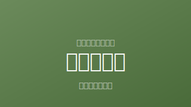

# Claude Code 実装指示書
## tsubasa-memo.github.io への新記事追加

---

## 前提

- リポジトリ: `tsubasa-memo/tsubasa-memo.github.io`
- 作業ブランチ: `main`（直接コミットでOK）
- 追加するファイル: `sasage-outsource.html`（添付ファイルを使用）

---

## タスク一覧

### タスク1: 新記事ファイルを追加する

添付した `sasage-outsource.html` を、リポジトリのルートディレクトリに配置する。

```
tsubasa-memo.github.io/
└── sasage-outsource.html  ← 追加
```

---

### タスク2: `index.html` を更新する

#### 2-1. 既存の NEW バッジ記事を通常日付に変更する

`new-mac-2026.html` のカードを探す。
現在の `<span class="card-num new">NEW</span>` を `<span class="card-num">2026.03</span>` に変更する。

#### 2-2. 新記事カードをトップに挿入する

記事カード一覧の**先頭**（最初の `<div class="article-card">` の直前）に以下のカードを追加する。

```html
<div class="article-card">
<a href="sasage-outsource.html">
<span class="card-num new">NEW</span>
<h2>ささげ業務とは？代行会社の選び方と比較メモ【2026年版】</h2>
<p class="card-desc">撮影・採寸・原稿の頭文字をとった「ささげ」の意味から、代行会社の選び方・10社比較まで。EC担当者が外注先を探すときの備忘録。</p>
<span class="card-tag">EC・実務</span>
</a>
</div>
```

#### 2-3. 件数表示を更新する

`すべての記事を見る（全30件）` を `すべての記事を見る（全31件）` に変更する。

---

### タスク3: `archive.html` を更新する

#### 3-1. 新記事カードを追加する

既存カードの**先頭**（最初の `<div class="article-card"` の直前）に以下を追加する。

```html
<div class="article-card" data-cat="ec">
<a href="sasage-outsource.html">
<div class="card-thumb"></div>
<div class="card-body">
<span class="card-num">2026.03</span>
<h2>ささげ業務とは？代行会社の選び方と比較メモ【2026年版】</h2>
<p class="card-desc">撮影・採寸・原稿の頭文字をとった「ささげ」の意味から、代行会社の選び方・10社比較まで。EC担当者が外注先を探すときの備忘録。</p>
<span class="card-tag">EC・実務</span>
</div>
</a>
</div>
```

※ サムネイル画像 `thumbs/sasage-outsource.svg` は存在しないためエラーにはなるが、他の記事も同様の構造なので許容する。SVGファイルは後で別途追加する。

---

### タスク4: コミット・プッシュ

以下のコミットメッセージでプッシュする。

```
Add sasage-outsource article and update index/archive
```

---

## 完了確認

- [ ] `sasage-outsource.html` がルートに存在する
- [ ] `index.html` の先頭カードが `sasage-outsource.html` になっている
- [ ] `index.html` の件数が `全31件` になっている
- [ ] `archive.html` の先頭カードに `sasage-outsource.html` が追加されている
- [ ] `main` ブランチにプッシュ済み
